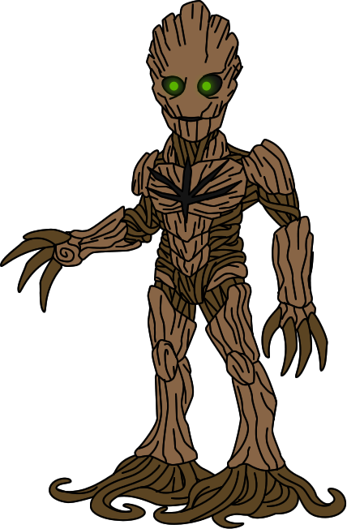

# GrootFS: Garden root file system

[](http://slack.cloudfoundry.org)

**Note:** This repository should be imported as
`code.cloudfoundry.org/grootfs`.



[by](https://creativecommons.org/licenses/by-nc-nd/3.0/)
[chattanooga-choochoo](http://chattanooga-choochoo.deviantart.com/art/Groot-584361210)

GrootFS is the [Cloud Foundry](https://www.cloudfoundry.org) component
that provides filesystem isolation for containers
and deals with container (Docker and OCI) images.

You can find us in the #grootfs channel
of the [Cloud Foundry Slack](https://cloudfoundry.slack.com).
Use [https://slack.cloudfoundry.org](https://slack.cloudfoundry.org)
to request an invitation.


# Index

* [Installation](#installation)
* [Configuration](#configuration)
* [Initializing a store](#initializing-a-store)
* [Deleting a store](#deleting-a-store)
* [Create an image](#creating-an-image)
* [Delete an image](#deleting-an-image)
* [Stats](#stats)
* [Clean up](#clean-up)
* [Logging](#logging)
* [Metrics](#metrics)
* [Running tests in Concourse](#running-tests-in-concourse)
* [Known Issues](#known-issues)

## Installation

The simplest way to install GrootFS,
is to download the latest compiled release
from the [releases page](https://github.com/cloudfoundry/grootfs/releases):

```
$> curl -o /usr/local/bin/grootfs -L https://github.com/cloudfoundry/grootfs/releases/download/v0.25.0/grootfs-0.25.0
$> chmod +x /usr/local/bin/grootfs
$> grootfs --version
grootfs version 0.25.0
```

### Filesystems

GrootFS makes use of various Linux filesystem features in order to efficiently store
container root filesystems on the host machine.

Currently we support:
* BTRFS (`--driver btrfs`)
* Overlay on XFS (`--driver overlay-xfs`)

GrootFS's 'store' directory must be stored on one of these filesystems. Our setup
script will try to set up both of these filesystems for you so you can experiment
with GrootFS, or you can provision your own and configure GrootFS to point to the
mounted filesystem you create, using the `--store` and `--driver` command-line flags.
These are documented in the instructions below.


### Instructions

#### Requirements
```
sudo hack/quick-setup
```

We assume that:
* You are running a Debian/Ubuntu based system with BTRFS and XFS enabled in the kernel

This will:
* Install the userspace tools required to use GrootFS on either BTRFS or XFS
* Create a BTRFS filesystem and mount it under /var/lib/grootfs/btrfs
* Create an XFS filesystem and mount it under /var/lib/grootfs/xfs

By default all operations will happen in the `/var/lib/grootfs` folder. You can
change this by passing the `--store` flag to the `grootfs` binary. The store folder is
expected to be inside either of the mounted BTRFS or XFS volumes. You will also
need to pass the `--driver` option with a value of either `btrfs` or `overlay-xfs`
accordingly.

For user/group id mapping, you'll also require `newuidmap` and `newgidmap` to be
installed (uidmap package on Ubuntu)

### Configuration

GrootFS can optionally be configured with a YAML config file. If both a config file and command
line arguments are provided, the command line arguments will take precedence.

To use a config file:

```
grootfs --config ./my-config.yml <command> ...
```

Following is an example configuration file with all options provided:

```yaml
store: /var/lib/data/grootfs/store
driver: btrfs
btrfs_progs_path: /var/lib/packages/btrfs-progs/bin
drax_bin: /var/lib/packages/grootfs/bin/drax
newuidmap_bin: /var/lib/packages/idmapper/bin/newuidmap
newgidmap_bin: /var/lib/packages/idmapper/bin/newgidmap
log_level: debug
metron_endpoint: 127.0.0.1:8081
clean:
  threshold_bytes: 1048576
  ignore_images:
    - docker:///ubuntu
    - docker://my-docker-registry.example.com:1234/busybox
create:
  insecure_registries:
  - my-docker-registry.example.com:1234
  with_clean: true
```

| Key | Description  |
|---|---|
| store  | Path to the store directory |
| driver | Filesystem driver to use \<btrfs \| overlay-xfs\> |
| btrfs_progs_path  | Path to btrfs progs. (If not provided will use $PATH)  |
| drax_bin | Path to drax bin. (If not provided will use $PATH) |
| newuidmap_bin | Path to newuidmap bin. (If not provided will use $PATH) |
| newgidmap_bin | Path to newgidmap bin. (If not provided will use $PATH) |
| log_level | Set logging level \<debug \| info \| error \| fatal\> |
| metron_endpoint | Metron endpoint used to send metrics |
| create.insecure_registries | Whitelist a private registry |
| create.with\_clean | Clean up unused layers before creating rootfs |
| create.without_mount | Don't perform the rootfs mount. |
| clean.ignore\_images | Images to ignore during cleanup |
| clean.threshold\_bytes | Disk usage of the store directory at which cleanup should trigger |


### Initializing a store

If you have an existing XFS or BTRFS filesystem mounted, you can use this to hold GrootFS's image store.
To create a store directory within your existing mountpath:

```
grootfs --store /mnt/xfs/my-store-dir --driver overlay-xfs init-store <--uid-mapping 1000:0:1> <--gid-mapping 1000:0:1> <--uid-mapping/gid-mapping ...>
```

N.B.
- The `driver` you pass to init-store must be compatible with the mounted path.
- The command can currently only be run as root, with the mounted store owned by root.
- It can take a number of uid/gid mappings to initialize the store with.
- If no mappings are provided, the store will be owned by host root user.
- If mappings are provided, the store will be owned by the namespace root user specified.

#### --store-size-bytes

If you have no existing filesystem, or want to create a dedicated one for GrootFS, `init-store`
accepts the `--store-size-bytes` flag which allows you to specify the size of a newly created store.

This command will:
1. create a new file (of the size provided to `--store-size-bytes`) at /store/path.backing-store
1. format it with a filesystem
1. mount it at /store/path


#### --uid-mapping / --gid-mapping

User and group id mappings are a property of the store and, if desired, must be
set as part of the `init-store` command. All `create` commands ran against that
store will use the same mapping.

* If you're not running as root, and you want to use mappings, you'll also need
  to map root (`0:--your-user-id:1`)
* Your id mappings can't overlap (e.g. 1:100000:65000 and 100:1000:200)
* You need to have these [mappings
  allowed](http://man7.org/linux/man-pages/man5/subuid.5.html) in the
  `/etc/subuid` and `/etc/subgid` files

### Deleting a store

You can delete a store by running the following:

While this command will delete all contents of the store path, it will leave
the backing filesystem intact.
```
grootfs --store /mnt/btrfs/my-store-dir --driver btrfs delete-store
```

### Creating an image

You can create a rootfs image based on a remote docker image:

```
grootfs --store /mnt/btrfs create docker:///ubuntu:latest my-image-id
```

Or from a local tar file as an image source:

```
grootfs --store /mnt/btrfs create /my-rootfs.tar my-image-id
```

#### Output

The output of this command is a json object which has the following structure:

```
{
  "rootfs": "...", # complete path to the image rootfs, which lives in <image-path>/rootfs
  "config": {...}, # contents of image config, also writen to <image-path>/image.json
}
```

* The `<image-path>/rootfs` folder is where the root filesystem lives.
* The `<image-path>/image.json` file follows the [OCI image
  description](https://github.com/opencontainers/image-spec/blob/master/serialization.md#image-json-description)
  schema.


If the `--without-mount` flag is provided  (or `create.without_mount = true` in config),
the json output will also contain the `mount` key:

```
  ...
  "mount": {
    "destination": "/path/to/rootfs",
    "type": "overlay",
    "source": "overlay",
    "options": ["lowerdir=..."]
  }
  ...
```

The `--without-mount` option exists so that GrootFS can be run as non-root. The mount information is compatible
with [OCI container spec](https://github.com/opencontainers/runtime-spec/blob/master/config.md#example-linux).

#### Disk Quotas & Drax

GrootFS supports per-filesystem disk-quotas through the Drax binary. BTRFS
disk-quotas can only be enabled by a root user, therefore Drax must be owned by
root, with the user bit set, and moved somewhere in the $PATH.

```
make
chown root drax
chmod u+s drax
mv drax /usr/local/bin/
```

Once Drax is configured, you can apply a quota to the rootfs:

```
grootfs --store /mnt/btrfs create \
        --disk-limit-size-bytes 10485760 \
        docker:///ubuntu:latest \
        my-image-id
```

### Deleting an image

You can destroy a created rootfs image by calling `grootfs delete` with the
image-id:

```
grootfs --store /mnt/btrfs delete my-image-id
```

Or the rootfs image path:

```
grootfs --store /mnt/btrfs delete /mnt/btrfs/images/<uid>/my-image-id
```

**Caveats:**

The store is based on the effective user running the command. If the user tries
to delete a rootfs image that does not belong to her/him the command fails.

### Stats

You can get stats from an image by calling `grootfs stats` with the
image-id:

```
grootfs --store /mnt/btrfs stats my-image-id
```

Or the image path:

```
grootfs --store /mnt/btrfs delete /mnt/btrfs/images/<uid>/my-image-id
```

This will result in a JSON object of the following form:

```
{
  "disk_usage": {
    "total_bytes_used": 132169728,
    "exclusive_bytes_used": 16384
  }
}
```

`total_bytes_used` refers to the total space the image takes.
`exclusive_bytes_used` is the amount of space the image takes excluding the
base image, i.e.: just the container data.

### Clean up

```
grootfs --store /mnt/btrfs clean
```

When `clean` is called, any layers that aren't being used by a rootfs that
currently exists are deleted from the store\*.

For example: Imagine that we create two rootfs images from different base
images, `Image A` and `Image B`:

```
- Image A
  Layers:
    - layer-1
    - layer-2
    - layer-3

- Image B
  Layers:
    - layer-1
    - layer-4
    - layer-5

```

They have a layer in common, `layer-1`. And after deleting `Image B`,
`layer-4` and `layer-5` can be collected by `clean`, but not `layer-1` because
`Image A` still uses that layer.

It is safe to run the command in parallel, it does not interfere with other
creations or deletions.

The `clean` command has an optional integer parameter, `threshold-bytes`, and
when the store\* size is under that `clean` is a no-op, it does not remove
anything. On the other hand, if the store\* is over the threshold it cleans up
any resource that is not being used.  If 0 is provided it will behave the same
way as if the flag wasn't specified, it will clean up everything that's not
being used.  If a non integer or negative integer is provided, the command
fails without cleaning up anything.

**Caveats:**

The store is based on the effective user running the command. If the user tries
to clean up a store that does not belong to her/him the command fails.

\* It takes only into account the volumes folders in the store.

### Logging

By default GrootFS will not emit any logging, you can set the log level with
the `--log-level` flag:

```
grootfs --log-level debug create ...
```

It also supports redirecting the logs to a log file:

```
grootfs --log-level debug --log-file /var/log/grootfs.log create ...
```

## Metrics

GrootFS emits the following metrics with each command. These are emitted via
Dropsonde to the Metron Agent and can be integrated with a monitoring application
e.g. Datadog.

#### Create
| Metric Name | Units | Description |
|---|---|---|
| `ImageCreationTime` | nanos | Total duration of Image Creation |
| `UnpackTime` | nanos | Total time taken to unpack the base image tarball |
| `FailedUnpackTime` | nanos | Same as above but emitted on failure |
| `StoreUsage` | bytes | Total bytes in use in the Store at the end of the command |
| `LockingTime` | nanos | Total time the store lock is held by the command |
| `grootfs-create.run` | int | Cumulative count of Create executions |
| `grootfs-create.fail` | int | Cumulative count of failed Create executions |
| `grootfs-create.success` | int | Cumulative count of successful Create executions |
| `grootfs-error.create` | | Emits when an error has occurred |

#### Clean
| Metric Name | Units | Description |
|---|---|---|
| `ImageCleanTime` | nanos | Total duration of Clean |
| `StoreUsage` | bytes | Total bytes in use in the Store at the end of the command |
| `LockingTime` | nanos | Total time the store lock is held by the command |
| `grootfs-clean.run` | int | Cumulative count of Clean executions |
| `grootfs-clean.fail` | int | Cumulative count of failed Clean executions |
| `grootfs-clean.success` | int | Cumulative count of successful Clean executions |
| `grootfs-error.clean` | | Emits when an error has occurred |

#### Delete
| Metric Name | Units | Description |
|---|---|---|
| `ImageDeletionTime` | nanos | Total duration of Image Deletion |
| `grootfs-delete.run` | int | Cumulative count of Delete executions |
| `grootfs-delete.fail` | int | Cumulative count of failed Delete executions |
| `grootfs-delete.success` | int | Cumulative count of successful Delete executions |
| `grootfs-error.delete` | | Emits when an error has occurred |

#### Stats
| Metric Name | Units | Description |
|---|---|---|
| `ImageStatsTime` | nanos | Total duration of retrieving Image Stats |
| `grootfs-stats.run` | int | Cumulative count of Stats executions |
| `grootfs-stats.fail` | int | Cumulative count of failed Stats executions |
| `grootfs-stats.success` | int | Cumulative count of successful Stats executions |
| `grootfs-error.stats` | | Emits when an error has occurred |

## Running tests in Concourse

GrootFS uses [Concourse](http://concourse.ci/) for both Continuous Integration
(CI) and testing. One way of running tests locally is with
`concourse-lite`, which is a [Vagrant](https://www.vagrantup.com/) box.

### Starting Concourse Lite
```
vagrant box add concourse/lite
vagrant init concourse/lite
vagrant up
```

### Running tests

To run all tests

```
make test
```

To run just unit or integration tests

```
make unit
make integration
```


## Known Issues

#### Restrictions when running as a non-root user

* GrootFS cannot use `docker:///centos` when run as a non-root user without
  UID/GID mappings. CentOS sets the `/root` permissions to 0550 (i.e.:
  `r-xr-x---`) and therefore, when GrootFS runs as a non-root user it cannot
  write files into the rootfs `/root`. You can work around this by either
  running as root or [using a UID/GID mapping](#usergroup-id-mapping).

* You must mount the btrfs volume with `-o user_subvol_rm_allowed` or you
  won't be able to delete images or clean up after failure scenarios.

* Files not visible to the calling user in the base image won't be in the
  resulting rootfs.

* The store must have the right permissions or ownership for the calling user
  otherwise the command will fail.

* The calling user can only delete the rootfs that it owns.

* The calling user can only cleanup the cached volumes that it owns.

* The calling user can only request stats for the rootfs that it owns.

## Misc

* All devices inside a image are ignored.

## Links

* [Garden project](https://github.com/cloudfoundry/garden)
* [GrootFS Pivotal tracker](https://www.pivotaltracker.com/n/projects/1661239)
* [GrootFS CI](https://grootfs.ci.cf-app.com)
* [Cloud Foundry Slack - Invitation](https://slack.cloudfoundry.org/)
* [Cloud Foundry Slack](https://cloudfoundry.slack.com/)
